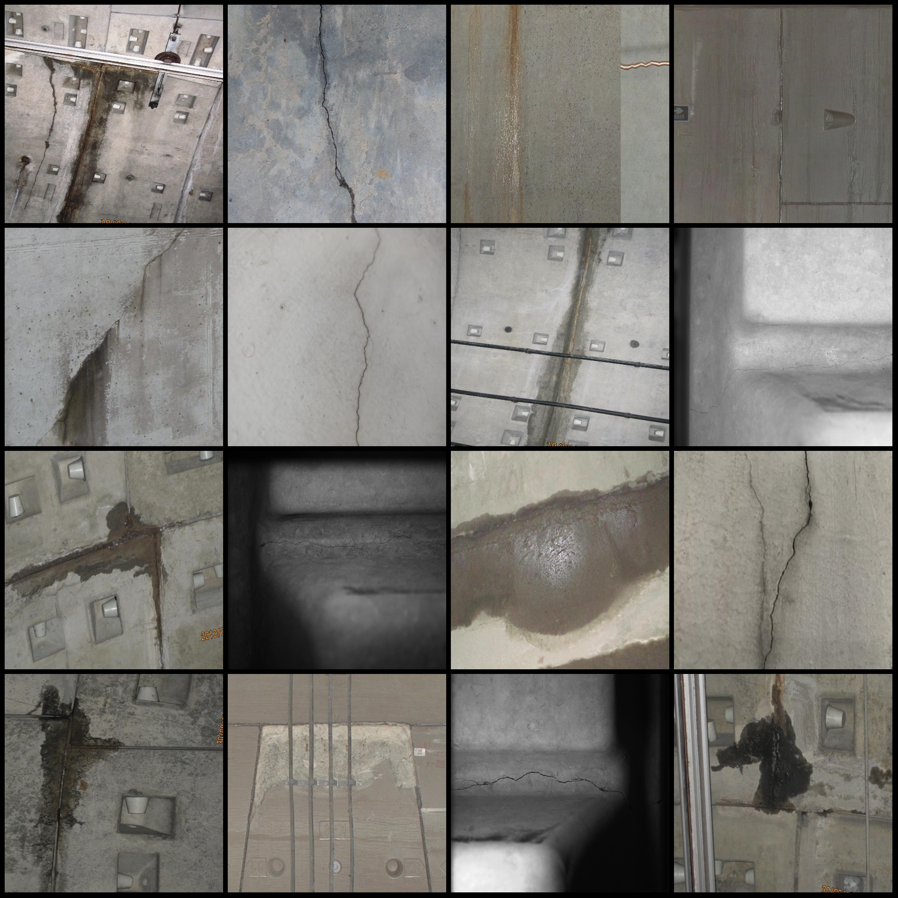
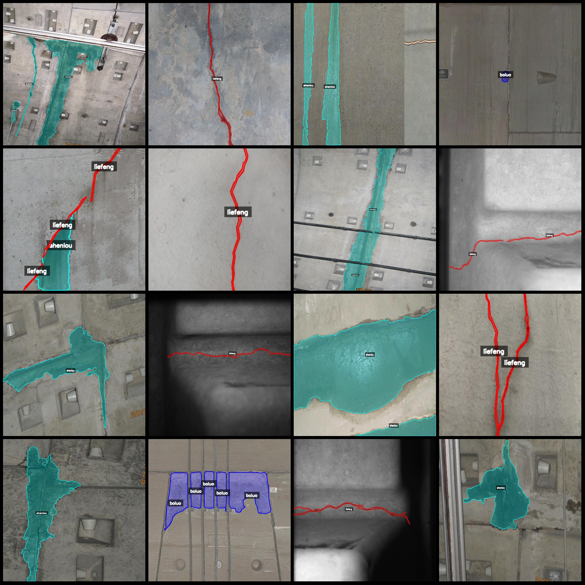
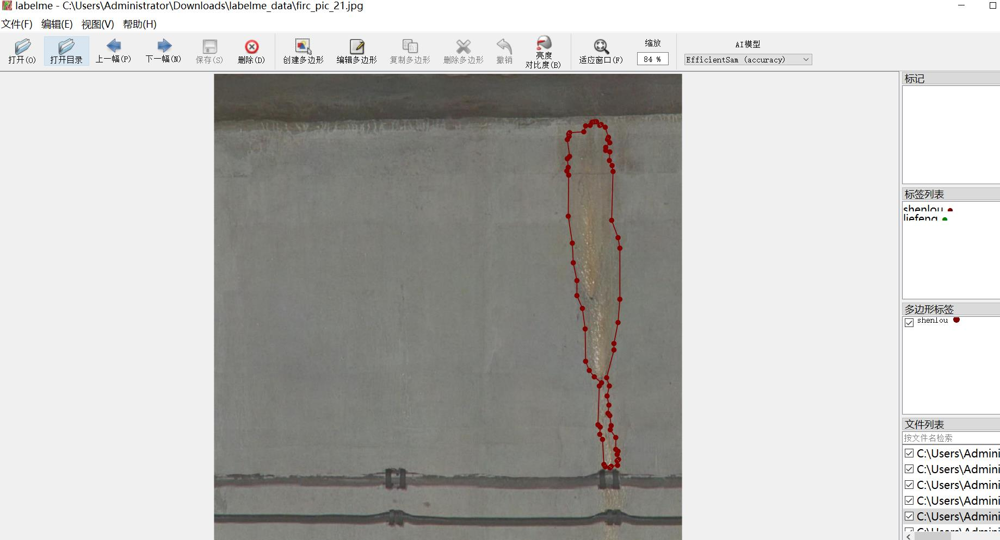

# Road Tunnel and Railway Tunnel Crack, Leakage, and Falling Off Identification and Segmentation Data Set (labelme format) - 471 images in 3 categories

Dataset format: labelme format (excluding mask files, only containing jpg images and corresponding json files)
Number of images (number of jpg files): 471
Number of annotations (json file count): 471
Number of annotation categories: 3
Annotation category names: ["falling off", "crack", "leak"]
["Peeling", "Crack", "Leakage"]
Number of bounding boxes for each category:
- Number of falling off counts: 124
- Number of crack counts: 214
- Number of leak counts: 308
Total bounding box count: 646
Annotation tool used: labelme = 5.5.0
Image resolutions: Multiple resolution images such as 1400x1200, 1600x1200, etc.
Annotation rules: Draw polygons around the categories
Important notes: The dataset can be opened and edited using labelme; json datasets need to be converted into mask or yolo format or coco format for semantic segmentation or instance segmentation.
Special declaration: This dataset does not guarantee the accuracy of the trained models or weight files.
Image previews:
Annotation example:
Annotation drawing results:
Labelme editing image examples:
## Images

Here is a pay link on Stripe ( https://buy.stripe.com/3cs8yP7sY87d0vu9AB ). Please contact me lonlonago@foxmail.com after funding $89, and I will send you a complete data files , thank you!

